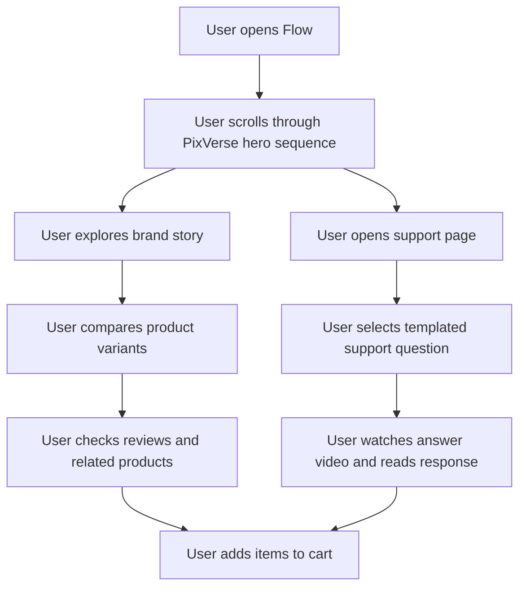

## 1. Product Overview
Flow is a premium Indonesian sneaker and footwear showcase site built for the TRAE x PixVerse hackathon, combining cinematic product storytelling with ecommerce-style interaction.
- The product turns PixVerse-generated motion assets into the main sales surface: a scroll-driven hero sequence with multiple shoe perspectives, followed by rich storefront sections and a dedicated support-video page.
- The target value is a memorable brand experience that feels more like a luxury campaign film than a standard product grid, while still supporting discovery, selection, and cart intent.

## 2. Core Features

### 2.1 Feature Module
1. **Showcase home page**: cinematic hero, brand story, product variants, social proof, related products, sticky cart callout
2. **Support page**: customer support experience powered by a PixVerse-generated support host video and templated question-answer interactions

### 2.2 Page Details
| Page Name | Module Name | Feature description |
|-----------|-------------|---------------------|
| Home page | Global header | Floating navigation with Flow wordmark in red, compact cart status, fast links to story, variants, reviews, related, and support |
| Home page | Scroll hero filmstrip | Full-screen scroll-driven sequence of PixVerse-generated video shots that reveal multiple hero products from different perspectives; timeline indicators, product labels, and CTA overlays update as the user scrolls |
| Home page | Story section | Brand manifesto focused on premium Indonesian craft, streetwear credibility, and cinematic product identity |
| Home page | Variant section | Interactive product cards for multiple sneakers/shoes, showing colorways, materials, silhouette notes, price, and quick add-to-cart actions |
| Home page | Review section | Curated review cards, rating summary, and editorial pull-quotes designed like premium fashion press snippets |
| Home page | Related section | Cross-sell products displayed as complementary releases or matching silhouettes |
| Home page | Cart section | Persistent mini-cart summary with selected items, totals, and a clear purchase intent CTA |
| Support page | Support hero | Introductory support layout featuring a PixVerse-generated support person video and brand reassurance copy |
| Support page | Template Q&A selector | Selectable templated customer questions such as shipping, sizing, authenticity, returns, and payment methods |
| Support page | Answer stage | Visual answer panel synchronized with the support persona video, surfacing the relevant scripted response with clear key points |

## 3. Core Process
Users land on the home page and are immediately pulled into the scroll-driven hero sequence, where cinematic video shots establish the premium identity of the featured shoes. As they continue downward, they move through story-led content, compare variants, evaluate reviews, inspect related products, and build cart intent. When they need reassurance, they can open the support page, choose a templated question, and receive a video-led answer from the support persona.

## 4. User Interface Design
### 4.1 Design Style
- Primary colors: deep black base, graphite neutrals, and aggressive crimson red accents; the `Flow` wordmark is always rendered in red
- Button style: sharp-edged premium buttons with subtle bevel, glow-on-hover, and motion-tracked highlight
- Fonts and sizes: expressive editorial display serif for hero headlines paired with a refined grotesk/sans for body and commerce UI
- Layout style: desktop-first, cinematic, asymmetrical editorial composition with stacked panels and pinned storytelling moments
- Icon style suggestions: lean, minimal line icons with luxury-tech styling; avoid playful iconography
- Motion direction: scroll-synced reveals, masked text entrances, soft parallax layers, and confident product panel transitions

### 4.2 Page Design Overview
| Page Name | Module Name | UI Elements |
|-----------|-------------|-------------|
| Home page | Global shell | Dark luxury interface, red navigation accents, floating utility bar, crisp hover states |
| Home page | Scroll hero filmstrip | Full-viewport panels, layered video masking, red progress rail, product metadata chips, large editorial headline treatment |
| Home page | Story section | Split editorial grid, dramatic typography, craft details, subtle texture and grain overlays |
| Home page | Variant section | Product cards with material swatches, angle thumbnails, price block, add-to-cart actions, hover-driven reveal states |
| Home page | Review section | Review cards styled like premium magazine snippets with star ratings and customer identity tags |
| Home page | Related section | Horizontal release gallery, strong cover imagery, concise product metadata |
| Home page | Cart section | Sticky summary module, item count, subtotal, premium checkout CTA, trust copy |
| Support page | Support hero | Full-bleed support video frame, side panel copy, reassurance messaging, brand-stable black/red palette |
| Support page | Template Q&A selector | Pill or card selectors with active red state, responsive content switcher, answer summary text |
| Support page | Answer stage | Transcript block, highlighted keywords, response duration cue, smooth fade transitions |

### 4.3 Responsiveness
The experience is designed desktop-first, with the hero sequence optimized for large screens and immersive scrolling. On tablet and mobile, the hero collapses into shorter stacked sequences, sticky navigation is simplified, product cards become swipe-friendly, and support Q&A controls become vertically ordered touch targets.

### 4.4 3D Scene Guidance
- Environment and mood: luxury studio-meets-streetwear atmosphere with dark reflective surfaces and restrained industrial ambience
- Lighting setup: high-contrast key light, red edge lighting, controlled specular highlights to emphasize leather, mesh, and outsole textures
- Camera settings and motion: slow orbital moves, low-angle detail passes, macro close-ups, and dramatic push-ins for premium emphasis
- Composition and focal elements: isolate one hero product at a time, then cut to detail inserts and multi-product comparison tableaux
- Interactions and animations: scroll progression drives shot changes, product callouts, and synchronized caption transitions
- Post-processing effects: subtle bloom on highlights, fine grain, reflective glints, and restrained motion blur
- Asset sources and performance budgets: compressed MP4/WebM hero loops, poster fallbacks, lazy loading for below-the-fold video, maintain smooth playback on modern laptops
