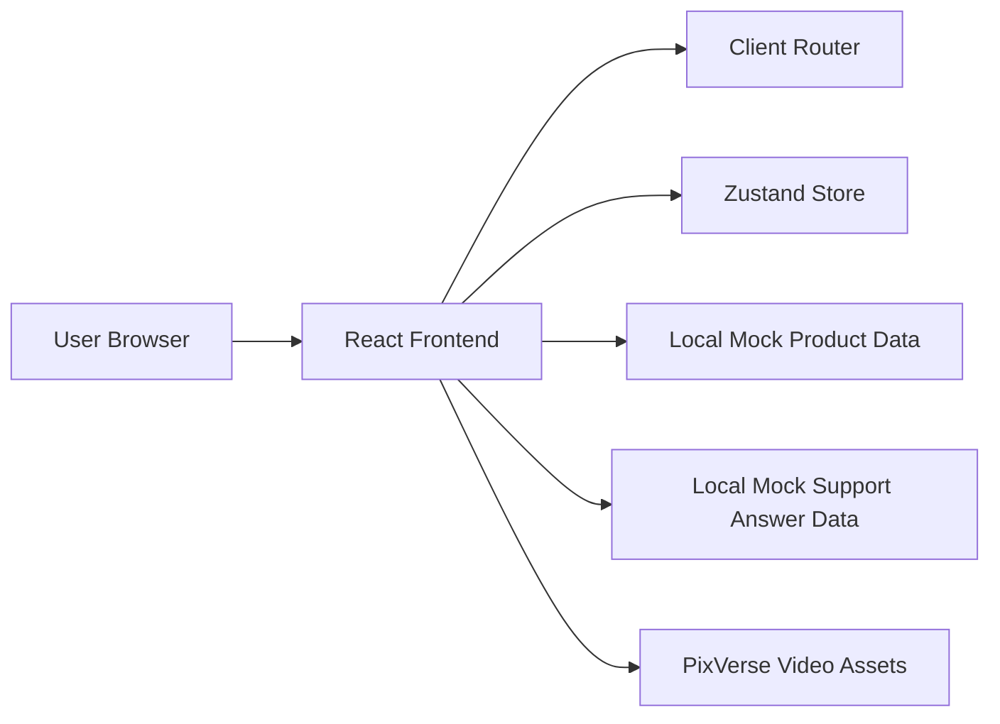

## 1. Architecture Design


## 2. Technology Description
- Frontend: React 18 + TypeScript + Vite + Tailwind CSS
- Initialization Tool: `vite-init`
- State Management: Zustand for cart state, active product state, and support Q&A state
- Routing: `react-router-dom` for the showcase route and support route
- Animation and interaction: CSS transitions plus scroll-driven React logic using native browser APIs
- Backend: None for the hackathon build; use local mock content and asset references
- Database: None; structured mock data stored in TypeScript modules
- Media strategy: PixVerse-generated video files referenced as static assets with poster fallbacks

## 3. Route Definitions
| Route | Purpose |
|-------|---------|
| / | Single-page premium product showcase with scroll-driven hero and ecommerce sections |
| /support | Customer support experience with video-led templated answers |

## 4. Data Definitions
### 4.1 Frontend Data Types
```ts
export type ProductVariant = {
  id: string;
  name: string;
  category: "Sneaker" | "Runner" | "Leather";
  price: number;
  accent: string;
  description: string;
  materials: string[];
  angles: Array<{
    id: string;
    label: string;
    videoSrc: string;
    posterSrc: string;
  }>;
};

export type ReviewItem = {
  id: string;
  author: string;
  location: string;
  rating: number;
  quote: string;
};

export type SupportQuestion = {
  id: string;
  label: string;
  shortPrompt: string;
  answerTitle: string;
  answerBody: string;
  videoCue: string;
};

export type CartItem = {
  productId: string;
  quantity: number;
};
```

### 4.2 State Model
- `useCartStore`: selected items, quantity updates, subtotal computation
- `useShowcaseStore`: active hero shot, active variant, hero timeline progress
- `useSupportStore`: selected template question, active answer content, support playback cue

## 5. Module Structure
| Path | Responsibility |
|------|----------------|
| `src/pages/HomePage.tsx` | Main showcase page composition |
| `src/pages/SupportPage.tsx` | Support page composition |
| `src/components/shell/SiteHeader.tsx` | Global header, navigation, and cart popup UI |
| `src/components/hero/*` | Scroll-driven hero panels, timeline, overlays |
| `src/components/commerce/*` | Story, variants, and reviews sections |
| `src/components/support/*` | Support video stage, templated question selector, answer details |
| `src/store/*` | Zustand stores |
| `src/data/*` | Mock products, reviews, support templates |
| `src/utils/*` | Scroll math, currency formatting, helper utilities |
| `src/assets/*` | PixVerse video references, posters, textures |

## 6. Rendering and Interaction Strategy
- Use a pinned or near-pinned hero structure that maps scroll progress to the active video shot and accompanying text overlays
- Keep video playback muted, inline, and optimized with poster images to avoid layout shifts
- Use CSS variables for brand colors, elevation, borders, and motion timing to keep styling consistent
- Implement reusable section wrappers so the single-page layout feels cohesive while staying modular
- Use route-level separation for `/support` to simplify focused support interactions and preserve performance

## 7. Testing Strategy
- Use Vitest and React Testing Library for component rendering and core interaction tests
- Verify cart logic, support question switching, and hero progress mapping with focused unit tests
- Run `npm run check` after implementation to validate TypeScript and project health
- Run the local development server and verify the final experience in-browser, including route navigation and visible section states
