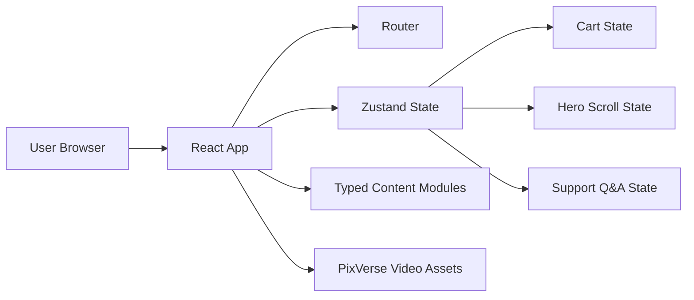

# ARCHITECTURE.md

## Overview
`Flow` is a frontend-first React application built around a cinematic single-page product showcase and a dedicated support route. The architecture prioritizes immersive media presentation, lightweight state management, and modular section composition over backend complexity.

This document is the repository-level architecture summary. Detailed planning remains in:
- `.trae/documents/flow-prd.md`
- `.trae/documents/flow-technical-architecture.md`
- `.trae/documents/flow-page-design.md`

## System Shape


## Core Routes
- `/`: premium single-page showcase with hero, story, variants, reviews, and a header cart popup
- `/support`: support experience with a PixVerse-generated host video and templated answers

## Frontend Layers

### App Shell
- routing
- global theme tokens
- navigation
- section spacing and shared layout primitives

### Showcase Layer
- shared sticky backdrop orchestration with section-triggered scene swaps
- scroll-driven hero copy and product state
- product storytelling sections
- cart intent UI (header popup)

### Support Layer
- support host video stage
- templated question selector
- answer content presentation

### Data Layer
- typed product data
- review data
- support question and answer data

### State Layer
- cart contents and derived subtotal
- active hero scene and timeline progress
- selected support question and answer state

## Technology Choices
- Framework: React 18
- Language: TypeScript
- Build tool: Vite
- Styling: Tailwind CSS plus project-level CSS variables/tokens
- Router: `react-router-dom`
- Client state: Zustand
- Testing: Vitest and React Testing Library

## Planned Repository Structure
```text
src/
  assets/
  components/
    commerce/
    hero/
    support/
  data/
  pages/
  store/
  utils/
```

## Media Architecture
- PixVerse-generated product videos act as primary hero media
- The home page uses a shared full-viewport backdrop layer instead of section-local embedded video players
- Sections declare a backdrop scene and the active media switches discretely as the user scrolls
- Support-host videos act as the primary support interaction media
- Poster images and fallback states are required to reduce layout shift and autoplay failure impact
- Video loading must be staged so the hero feels immediate even if all clips are not yet loaded

## Rendering Strategy
- Use a sticky full-viewport backdrop that crossfades between media states as sections become dominant in the viewport
- Keep hero copy and product metadata layered over the shared media stage
- Keep content sections modular so the single-page experience remains maintainable
- Separate support into its own route to reduce coupling between commerce storytelling and support interactions

## Performance Principles
- Favor native browser scrolling and media APIs where possible
- Keep animation dependencies lean
- Load below-the-fold media lazily
- Preserve readability and interaction quality if video playback is limited or motion is reduced

## Accessibility Principles
- Ensure narrative content is still understandable without autoplay video
- Preserve readable contrast across black/red surfaces
- Provide keyboard-accessible navigation and section controls
- Avoid encoding critical product information only in motion

## Current Scope Boundary
- No backend
- No database
- No real payment processing
- No live support chat

## Evolution Path
Possible later production expansions:
- CMS-backed product and review management
- CDN-backed media delivery and optimization
- Real cart persistence
- Checkout and payment integrations
- Customer service knowledge base or agent handoff flows
