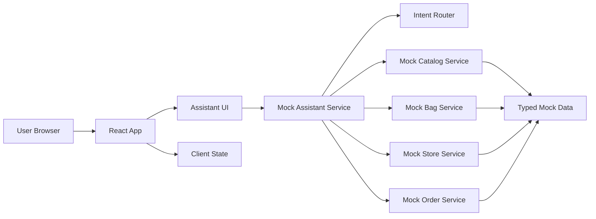

# ARCHITECTURE.md

## Overview
`Flow` is a frontend-first ecommerce shoes assistant. The app documents a backend/API contract but initially runs on local typed mock data and deterministic service functions.

The first build does not require a real LLM, database, MCP server, cloud deployment, auth provider, or payment service. Those are future extensions.

Detailed planning remains in:
- `.trae/documents/flow-prd.md`
- `.trae/documents/flow-technical-architecture.md`
- `.trae/documents/flow-page-design.md`

## System Shape


## Core Routes
- `/`: assistant-first shoe shopping storefront
- `/chat`: optional dedicated assistant route if needed later

## Frontend Layers

### App Shell
- global theme tokens
- header and navigation
- responsive layout
- bag indicator

### Assistant Layer
- assistant panel/modal/drawer
- suggested prompts
- message list
- input handling
- loading and fallback states
- response renderer

### Commerce Renderer Layer
- product list cards
- product detail cards
- bag summary
- store list
- delivery method cards
- order status cards
- inventory summary cards

### Mock Service Layer
- input normalization
- intent detection
- deterministic response routing
- catalog search
- bag mutations
- store sorting
- delivery method lookup
- mock order creation and lookup

### Data Layer
- typed product data
- variant data
- inventory data
- store data
- delivery method data
- mock user data
- optional seed order data

## Technology Choices
- Framework: latest stable React
- Language: TypeScript
- Build tool: Vite
- Styling: Tailwind CSS plus project-level CSS variables/tokens
- Client state: lightweight store or React state, depending on implementation size
- Testing: Vitest and React Testing Library
- Backend: optional mock API facade only

## Planned Repository Structure
```text
src/
  assets/
  components/
    assistant/
    commerce/
    layout/
  data/
  pages/
  services/
  store/
  types/
  utils/
```

## Mock Backend/API Boundary
The mock backend boundary is defined as service functions first. An HTTP facade may be added later using the same service logic.

Key functions:
- `getMockAssistantResponse`
- `detectIntent`
- `searchProducts`
- `getProductDetails`
- `addToBag`
- `getBagItems`
- `getNearbyStores`
- `getDeliveryMethods`
- `createMockOrder`
- `getUserOrders`
- `getStoreInventorySummary`

Optional endpoints:
- `GET /test`
- `POST /chat`
- `GET /api/products`
- `GET /api/products/:idOrSlug`
- `GET /api/stores`
- `GET /api/users/:userId/bag`
- `POST /api/users/:userId/bag/items`
- `POST /api/users/:userId/orders`

## Rendering Strategy
- Convert user input into structured assistant responses.
- Render response types with purpose-built ecommerce components.
- Avoid depending on raw text parsing for core UI.
- Keep fallback text for unsupported prompts.
- Keep suggested actions visible to guide the demo.

## Performance Principles
- Keep mock data small and typed.
- Avoid unnecessary dependencies in the mock phase.
- Use local assets where possible.
- Keep assistant rendering responsive on mobile and desktop.

## Accessibility Principles
- All assistant controls must be keyboard accessible.
- Product cards must expose meaningful text when images fail.
- Focus styles must be visible on dark backgrounds.
- Do not encode critical information only in color.
- Loading and fallback states must be readable.

## Current Scope Boundary
- Mock assistant only
- Mock data only
- Local/in-memory bag and orders
- No real checkout
- No production persistence
- No required auth

## Evolution Path
Possible later production expansions:
- real LLM-backed assistant
- database-backed products, inventory, users, carts, and orders
- auth-backed user profiles
- real store geospatial search
- persistent cart and order history
- checkout and payment integration
- product image CDN and media optimization
