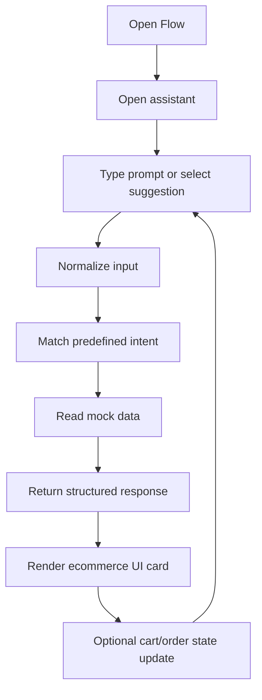

# Flow Product Requirements Document

## 1. Product Overview
Flow is an ecommerce shoes application built around a conversational shopping assistant. Users can ask for shoe recommendations, inspect product details, add items to a shopping bag, find nearby stores, view delivery options, and check mock order status.

The first release is a time-boxed demo. It must recreate the expected ecommerce assistant behavior without production infrastructure:
- No live LLM calls
- No database
- No MCP server
- No cloud deployment requirement
- No required auth provider
- No real payment flow

Instead, Flow uses mock products, variants, stores, users, delivery methods, inventory, carts, orders, and predefined assistant responses. The system should feel like a working assistant even though every response is deterministic.

## 2. Goals
- Let users shop for shoes through natural text input and suggested prompts.
- Demonstrate a complete ecommerce assistant journey from discovery to mock order status.
- Keep implementation simple enough to build quickly with local mock data.
- Define backend/API contracts clearly so the mock layer can later be replaced by real LLM and database infrastructure.
- Preserve Flow's premium black, graphite, and red brand direction.

## 3. Non-Goals
- No real LLM or AI inference in the initial build.
- No production database or persisted user accounts.
- No real Google sign-in, payment, shipping label, or checkout completion.
- No cloud service dependency for local demo.
- No marketplace-scale catalog. The mock catalog should be curated and small enough to manage in source control.

## 4. Target Users
- Shoe shoppers who want guided recommendations instead of browsing many filters.
- Hackathon judges or reviewers who need to see a complete assistant-driven ecommerce flow quickly.
- Developers who need a clean mock architecture that can later evolve into real service integrations.

## 5. Core User Journey
1. User opens Flow and sees a premium shoe storefront with a clear assistant CTA.
2. User opens the assistant panel and chooses a suggested prompt or types a request.
3. Assistant maps the input to a supported mock intent.
4. UI renders the response as product cards, product detail, cart summary, store list, delivery options, or order status.
5. User can continue the journey by asking follow-up questions or selecting suggested next actions.



## 6. Core Features

### 6.1 Assistant Entry
The home page must make the assistant the main action.

Requirements:
- Show the Flow wordmark in red.
- Show concise commerce copy focused on finding shoes.
- Provide a primary CTA such as "Start shopping".
- Open an assistant modal, drawer, or panel.
- Show an initial assistant greeting.
- Show suggested prompt chips for supported demo flows.

Suggested prompts:
- "I am looking for black sneakers for daily city wear"
- "Show red accent sneakers under Rp 1.500.000"
- "Tell me more about Flow Runner"
- "Add Flow Runner, size 42, black/red to my bag"
- "Show my bag"
- "Find Flow stores near Jakarta"
- "Show delivery options for Flow Senayan"
- "Place an order for pickup at Flow Senayan"
- "Check my order status"

### 6.2 Mock Assistant Router
The assistant must not call an LLM. It must route text to predefined deterministic responses.

Requirements:
- Normalize input by trimming, lowercasing, and removing filler words where useful.
- Detect supported intents:
  - greeting/help
  - product search
  - product detail
  - add to bag
  - show bag
  - remove or update bag item
  - find stores
  - show delivery methods
  - place mock order
  - check order status
  - inventory summary
- Return a fallback response when no intent matches.
- Ask one clarifying question if required information is missing.
- Keep all responses deterministic and testable.

Example fallback:
"I can help with product recommendations, product details, your bag, store pickup, delivery options, or mock order status. Try asking for black sneakers, red accent shoes, or stores near Jakarta."

### 6.3 Product Discovery
Users can ask for recommendations by keyword, category, style, price, color, or use case.

Requirements:
- Search mock product data by name, brand, category, description, material tags, color, use case, and price range.
- Rank exact name and brand matches first, then category/use-case matches, then popularity score.
- Return 3 to 5 results by default.
- Include image, name, price, colorway, short reason, and available sizes.
- Support Indonesian currency display using `Rp`.

Supported product categories:
- Sneaker
- Runner
- Court
- Slip-on
- Boot
- Sandal

Supported use cases:
- daily city wear
- running
- office casual
- travel
- rainy season
- limited drop

### 6.4 Product Detail
Users can ask for more detail about a specific shoe.

Requirements:
- Match by exact product name, slug, or close keyword.
- Show name, price, category, colorways, materials, available sizes, stock status, product story, and fit note.
- If multiple products match, ask the user to choose one.
- Provide follow-up actions: add to bag, compare, find store stock.

### 6.5 Shopping Bag
Users can add items to a local mock shopping bag.

Requirements:
- Add item by product, size, color, and quantity.
- If size or color is missing, ask one clarifying question with valid options.
- Show bag contents with item name, brand, category, size, color, price, quantity, and subtotal.
- Allow quantity updates and removal as follow-up implementation targets.
- Bag state can be in-memory or local client state and may reset on refresh during the demo phase.

### 6.6 Store Locator
Users can ask for stores near a mock user location or a supported city.

Requirements:
- Use mock store data.
- For the initial demo, prioritize Jakarta-area stores.
- Return stores sorted by mock distance.
- Display store name, address, city, distance, pickup availability, and stock summary.
- A visual map is optional. Store cards are acceptable for the first implementation.

### 6.7 Delivery Methods
Users can ask for delivery methods for a store or order.

Requirements:
- Return all mock delivery methods for the selected store.
- Include method name, description, cost, and estimated time.
- Support at least:
  - Store Pickup
  - Standard Delivery
  - Express Delivery

### 6.8 Mock Order Flow
Users can place a mock order from their bag.

Requirements:
- Require a non-empty bag.
- Require store and delivery method.
- Check mock inventory before creating an order.
- Create an in-memory order with status `pending`.
- Clear the bag after mock order creation.
- Show order ID, store, delivery method, items, total, and status.
- Clearly treat this as demo state, not real checkout.

### 6.9 Order Status
Users can ask for order status.

Requirements:
- If there are no mock orders, return a friendly empty state.
- If orders exist, show order ID, store, total, shipping/pickup details, status, items, and delivery method.
- Initial statuses can be `pending`, `confirmed`, `ready for pickup`, and `delivered`.

### 6.10 Inventory Summary
Users can ask whether a store has a brand/category in stock.

Requirements:
- Count matching products with quantity greater than zero.
- Return store, brand, category, and number of matching products.
- Use deterministic mock inventory.

## 7. Response Contracts

The preferred UI contract is structured JSON-like data returned by local mock functions. Legacy text formats may be supported only for compatibility testing.

### 7.1 Preferred Assistant Response Type
```ts
export type AssistantResponse =
  | ProductListResponse
  | ProductDetailResponse
  | BagResponse
  | StoreListResponse
  | DeliveryMethodsResponse
  | OrderListResponse
  | InventorySummaryResponse
  | ClarificationResponse
  | TextResponse;
```

### 7.2 Product List Response
```ts
export type ProductListResponse = {
  type: "product_list";
  title: string;
  products: ProductSummary[];
  suggestedActions: string[];
};
```

### 7.3 Text Compatibility Formats
If a plain-text `/chat` endpoint is implemented, it may preserve these parser-friendly formats:

```text
Here are some products:
Product: [name]
Image: [imageKey]
[description]
```

```text
Product Name: [name]
Price: Rp [price]
Brand: [brand]
Category: [category]
Sizes: [sizes]
Colors: [colors]
Description: [description]
```

```text
Ok [user_name], here is your bag:
Product: [product_name]
Brand: [brand]
Category: [category]
Size: [size]
Color: [color]
Price: Rp [price]
Quantity: [quantity]
```

The implementation should prefer structured renderers over parsing these strings.

## 8. Mock Data Requirements

Minimum seed data:
- 8 to 12 products
- 2 to 4 variants per product
- 3 to 5 store locations
- 3 delivery methods per store
- 1 mock user profile
- Inventory quantities per product variant and store
- Optional pre-seeded mock order for status demos

Product fields:
- `productId`
- `slug`
- `name`
- `brand`
- `category`
- `description`
- `price`
- `imageUrl`
- `colorways`
- `sizes`
- `materials`
- `useCases`
- `popularityScore`

## 9. Success Criteria
- A reviewer can complete product search, product detail, add-to-bag, store lookup, delivery option, mock order, and order status flows without external services.
- Supported inputs return deterministic responses.
- Missing information triggers one useful clarifying question.
- UI renders ecommerce cards for structured response types.
- Documentation clearly states that LLM, database, auth, and cloud services are future work, not current dependencies.

## 10. Future Evolution
- Replace deterministic router with a real LLM.
- Replace mock data with a real product database.
- Add real auth and user profiles.
- Add real inventory and order persistence.
- Add real checkout and payment processing.
- Add vector search or semantic product retrieval.
