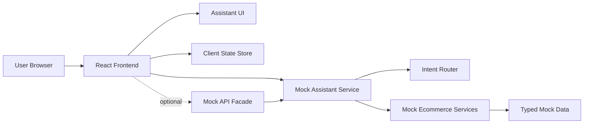

# Flow Technical Architecture

## 1. Architecture Design
Flow is a frontend-first ecommerce assistant app with a documented mock backend/API contract. The initial build can run entirely from local mock data and service functions. HTTP endpoints are optional for the first demo, but their contracts are defined so the mock layer can evolve into a real backend later.



## 2. Technology Description
- Frontend: latest stable React + TypeScript + Vite
- Styling: Tailwind CSS plus project-level CSS variables/tokens
- State management: lightweight client store for chat, selected product, bag, and mock orders
- Backend for initial demo: local mock service functions
- Optional API facade: small HTTP layer exposing the same mock service contracts
- Database: none in the initial build
- LLM: none in the initial build
- Auth: none in the initial build
- Payments: none in the initial build

## 3. Route Definitions
| Route | Purpose |
|-------|---------|
| `/` | Assistant-first ecommerce shoes storefront |
| `/chat` | Optional dedicated assistant route if modal UX becomes too constrained |

The first implementation may keep the assistant as a modal, drawer, or full-page panel inside `/`.

## 4. Frontend Module Structure
```text
src/
  assets/
    products/
  components/
    assistant/
      AssistantPanel.tsx
      MessageList.tsx
      PromptChips.tsx
      ResponseRenderer.tsx
    commerce/
      ProductCard.tsx
      ProductDetailCard.tsx
      BagSummary.tsx
      DeliveryMethodsCard.tsx
      OrderStatusCard.tsx
      StoreListCard.tsx
    layout/
      Header.tsx
      Shell.tsx
  data/
    mockProducts.ts
    mockStores.ts
    mockDeliveryMethods.ts
    mockInventory.ts
    mockUsers.ts
    mockOrders.ts
    suggestedPrompts.ts
  pages/
    HomePage.tsx
    ChatPage.tsx
  services/
    mockAssistantService.ts
    mockCatalogService.ts
    mockCartService.ts
    mockOrderService.ts
    mockStoreService.ts
  store/
    useAssistantStore.ts
    useBagStore.ts
  types/
    assistant.ts
    commerce.ts
  utils/
    currency.ts
    intent.ts
    distance.ts
```

## 5. Data Definitions

### 5.1 Commerce Types
```ts
export type Product = {
  productId: string;
  slug: string;
  name: string;
  brand: string;
  category: "Sneaker" | "Runner" | "Court" | "Slip-on" | "Boot" | "Sandal";
  description: string;
  price: number;
  imageUrl: string;
  colorways: string[];
  sizes: number[];
  materials: string[];
  useCases: string[];
  popularityScore: number;
};

export type ProductVariant = {
  variantId: string;
  productId: string;
  size: number;
  color: string;
  price: number;
};

export type Store = {
  storeId: string;
  name: string;
  address: string;
  city: string;
  postalCode: string;
  country: string;
  longitude: number;
  latitude: number;
  pickupAvailable: boolean;
};

export type InventoryItem = {
  inventoryId: string;
  variantId: string;
  storeId: string;
  quantity: number;
};

export type DeliveryMethod = {
  deliveryMethodId: string;
  storeId: string;
  name: "Store Pickup" | "Standard Delivery" | "Express Delivery";
  description: string;
  cost: number;
  estimatedDeliveryTime: string;
};

export type BagItem = {
  itemId: string;
  productId: string;
  variantId: string;
  size: number;
  color: string;
  quantity: number;
};

export type MockOrder = {
  orderId: string;
  userId: string;
  storeId: string;
  deliveryMethodId: string;
  status: "pending" | "confirmed" | "ready for pickup" | "delivered";
  items: BagItem[];
  totalAmount: number;
};
```

### 5.2 Assistant Types
```ts
export type AssistantIntent =
  | "help"
  | "product_search"
  | "product_detail"
  | "add_to_bag"
  | "show_bag"
  | "find_stores"
  | "delivery_methods"
  | "place_order"
  | "order_status"
  | "inventory_summary"
  | "fallback";

export type AssistantMessage = {
  id: string;
  role: "user" | "assistant";
  content: string;
  response?: AssistantResponse;
  createdAt: string;
};

export type AssistantResponse =
  | { type: "text"; title?: string; body: string; suggestedActions?: string[] }
  | { type: "clarification"; question: string; options: string[] }
  | { type: "product_list"; title: string; products: Product[]; suggestedActions?: string[] }
  | { type: "product_detail"; product: Product; variants: ProductVariant[]; suggestedActions?: string[] }
  | { type: "bag"; items: BagItem[]; subtotal: number; suggestedActions?: string[] }
  | { type: "store_list"; stores: Array<Store & { distanceKm: number }>; suggestedActions?: string[] }
  | { type: "delivery_methods"; methods: DeliveryMethod[]; suggestedActions?: string[] }
  | { type: "order_list"; orders: MockOrder[]; suggestedActions?: string[] }
  | { type: "inventory_summary"; storeName: string; brand: string; category: string; numberOfProducts: number };
```

## 6. Mock Service Functions

### 6.1 Assistant Service
```ts
export function getMockAssistantResponse(input: string, context: AssistantContext): AssistantResponse;
export function detectIntent(input: string): AssistantIntent;
export function normalizeInput(input: string): string;
```

Responsibilities:
- Normalize user input.
- Match to the best supported intent.
- Call the relevant mock ecommerce service.
- Return a structured assistant response.
- Return a fallback response when no intent matches.

### 6.2 Catalog Service
```ts
export function searchProducts(params: {
  query?: string;
  brand?: string;
  category?: string;
  color?: string;
  maxPrice?: number;
  useCase?: string;
  limit?: number;
}): Product[];

export function getProductDetails(productNameOrSlug: string): Product | null;
export function getProductVariants(productId: string): ProductVariant[];
export function getVariant(productId: string, size: number, color: string): ProductVariant | null;
```

### 6.3 Bag Service
```ts
export function getBagItems(userId: string): BagItem[];
export function addToBag(params: {
  userId: string;
  productNameOrSlug: string;
  size?: number;
  color?: string;
  quantity?: number;
}): AssistantResponse;
export function removeFromBag(userId: string, itemId: string): BagItem[];
export function getBagSubtotal(items: BagItem[]): number;
```

### 6.4 Store And Delivery Service
```ts
export function getNearbyStores(params: {
  userId?: string;
  longitude?: number;
  latitude?: number;
  city?: string;
}): Array<Store & { distanceKm: number }>;

export function getDeliveryMethods(storeId: string): DeliveryMethod[];
export function getStoreInventorySummary(params: {
  storeId: string;
  brand?: string;
  category?: string;
}): { storeName: string; brand: string; category: string; numberOfProducts: number };
```

### 6.5 Order Service
```ts
export function createMockOrder(params: {
  userId: string;
  storeId: string;
  deliveryMethodId: string;
}): MockOrder | AssistantResponse;

export function getUserOrders(userId: string): MockOrder[];
export function updateOrderDelivery(params: {
  userId: string;
  orderId: string;
  deliveryMethodId: string;
}): MockOrder | null;
```

## 7. Optional Mock API Contract
If a backend facade is added, it should call the same service logic used by the frontend.

| Method | Path | Purpose |
|--------|------|---------|
| `GET` | `/test` | Health check |
| `POST` | `/chat` | Deterministic assistant response |
| `GET` | `/images/:filename` | Resolve local product image |
| `GET` | `/api/products` | Search products |
| `GET` | `/api/products/:idOrSlug` | Get product details |
| `GET` | `/api/products/:productId/availability` | Check mock availability |
| `GET` | `/api/users/:userId` | Get mock user |
| `GET` | `/api/stores` | Find stores |
| `GET` | `/api/stores/:storeId/delivery-methods` | List delivery methods |
| `GET` | `/api/inventory/summary` | Store inventory summary |
| `GET` | `/api/users/:userId/bag` | Get bag |
| `POST` | `/api/users/:userId/bag/items` | Add bag item |
| `DELETE` | `/api/users/:userId/bag/items/:itemId` | Remove bag item |
| `GET` | `/api/users/:userId/orders` | List mock orders |
| `POST` | `/api/users/:userId/orders` | Create mock order |
| `PATCH` | `/api/users/:userId/orders/:orderId/delivery` | Update delivery method |

Error shape:
```json
{
  "error": {
    "code": "not_found",
    "message": "Product not found"
  }
}
```

Validation:
- Missing `message` on `/chat` must return `400`.
- Missing product, size, color, store, or delivery method should return a clarification response when possible.
- Unknown IDs should return `404` in HTTP mode.

## 8. Intent Matching Rules
- Greeting/help terms: `hello`, `hi`, `help`, `what can you do`
- Product search terms: `show`, `find`, `looking for`, `recommend`, `under`, `black`, `red`, `running`, `daily`, `office`, `rainy`
- Detail terms: `tell me about`, `details`, `more about`
- Add terms: `add`, `bag`, `cart`
- Bag terms: `show my bag`, `shopping list`, `cart`
- Store terms: `store`, `near`, `pickup`, `Jakarta`
- Delivery terms: `delivery`, `shipping`, `same day`, `pickup`
- Order terms: `place order`, `order status`, `check my order`
- Inventory terms: `in stock`, `available`, `inventory`

When multiple intents match, choose the later-stage commerce intent first:
1. order status
2. place order
3. add to bag
4. delivery methods
5. find stores
6. product detail
7. product search
8. help/fallback

## 9. State Model
- `assistant.messages`: full visible conversation
- `assistant.isOpen`: modal/drawer state
- `assistant.isLoading`: mock delay state
- `assistant.lastIntent`: last detected intent
- `bag.items`: current demo bag items
- `orders.items`: mock orders created during session
- `catalog.activeProductId`: product currently shown in detail view

State may be local only for the first phase. Persistence can be added later through localStorage or a real backend.

## 10. Testing Strategy
- Unit test `normalizeInput`.
- Unit test `detectIntent`.
- Unit test `searchProducts` ranking.
- Unit test `addToBag` clarification behavior.
- Unit test `createMockOrder` with empty bag and valid bag.
- Component test response renderers for product list, product detail, bag, stores, delivery methods, and orders.
- Smoke test the full prompt journey from assistant input to rendered response.
